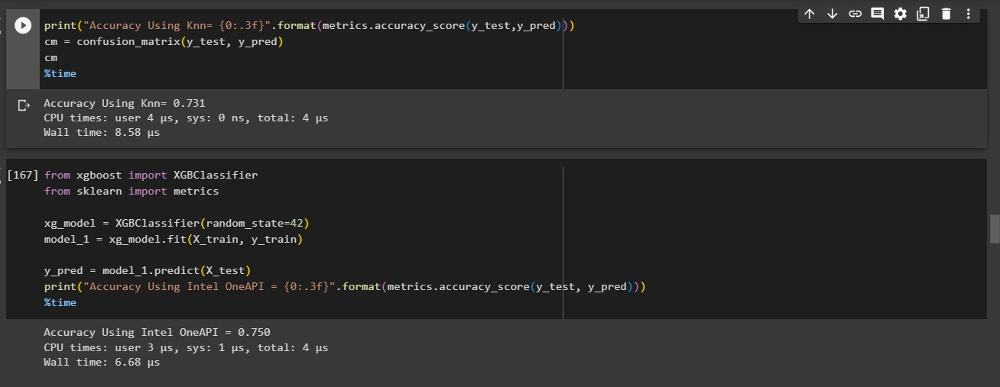

# **Diabetes Prediction Modle using oneAPI**
>The goal of this project is to build a diabetes prediction model using Intel oneAPI libraries and compare its performance to a regular model to evaluate its speed and accuracy.

## Requirements
>The first step is to install Intel oneAPI Toolkit packages.
```
!pip install modin
!pip install scikit-learn-intelex
```
> **Intel's Modin** package is a drop-in replacement for Pandas that enables data scientists to scale to distributed DataFrame processing without having to change API code. Modin transparently distributes the data and computation so that you can continue using the same Pandas API while working with more data faster. <br>
> The **scikit-learn-intelex** is an extension package for scikit-learn that provides accelerated implementations of popular machine learning algorithms. Scikit-learn-intelex is built on top of Intel oneAPI libraries, which are optimized to run on Intel hardware, including CPUs and GPUs.

## Use of Intel's XGBoost
> XGBoost is a scalable, distributed gradient boosting decision tree (GBDT) machine learning library. It provides parallel tree boosting and is the leading machine learning library for regression, classification, and ranking problems.

## Training Model Using Intel Extension For XGBoost (XGB classifier)
> The XGBClassifier is employed to enhance model accuracy and significantly improve wall time, signifying the tremendous performance and execution time benefits derived from the utilization of Intel's AI libraries. 
## Optimised Accuracy and Speed Results
> By implementing oneAPI toolkit we get faster execution time and more accurate results. <br>
> The accuracy increased by 2.59%. <br>
> The execution time decreased by 22%. <br>

